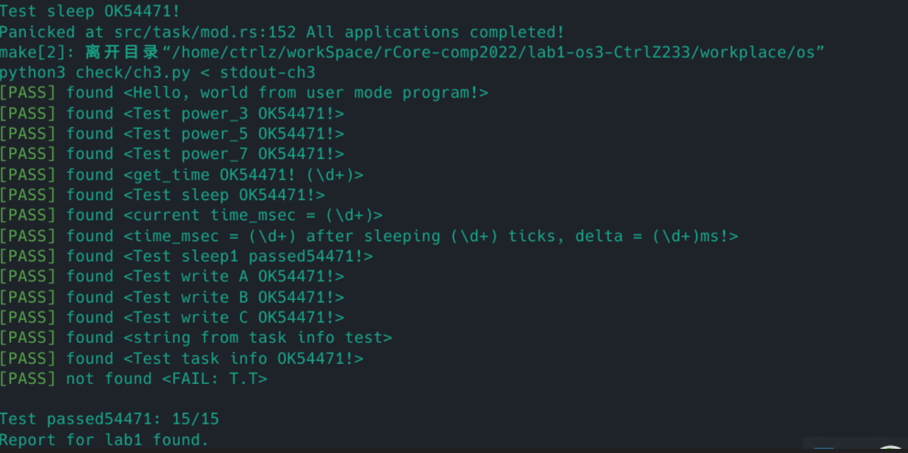

# Lab1实验报告

在TaskControlBlock中添加两个变量：exec_start_time和syscall_times，其中exec_start_time是usize，代表该进程开始执行的事件，初始化为0,  
syscall_times为一个长度为500的数组，用于统计各个系统调用的次数，初始化为0。

对于exec_start_time的赋值，首先在 run_first_task处对第一个任务进行赋值，然后在run_next_task中，判断选到的任务的exec_start_time是否为0,  
即是否是第一次被调度，如果是第一次被调度，需要对该变量赋值。

对于syscall_times，在进入trap_handler时，判断出是系统调用，在真正处理系统调用之前对其进行计数。 
### 实验截图

# 问答题
1. 使用RustSBI 0.2.2，三个Bad测试用例运行结果如下：  
   第一个访问物理地址为0的非法地址，访问非法导致报错。  
   第二个在U态使用`sret`的S态指令，导致非法报错。  
   第三个在U态访问`sstatus`的S态寄存器，导致报错。
2. A:
    1. 进入__restore时，a0存储了上一次调度时被换出的任务上下文的地址。__restore的第一种使用场景是内核初始化完成，从内核进入用户态，第二种使用场景是用户态陷入内核态处理完成后返回用户态。
    2. 主要是为了恢复三个特殊的寄存器sstatus、sepc、sscratch，使用csrw指令来写特殊寄存器，源操作数必须是寄存器，因此必须用三个通用寄存器先把源数据存起来。所以恢复三个特殊寄存器必须在恢复通用寄存器之前。
    3. x2/x4是sp/tp寄存器，sp寄存器我们不需要存储到TrapContext中而是直接存储到sscratch中，tp寄存器存了当前的硬件线程id，暂时不需要使用到。
    4. sp指向用户栈，sscratch指向内核栈。
    5. 执行sret指令后会发生状态切换。SPP寄存器指出了在进入S态之前的CPU状态，执行sret指令后，CPU会根据SPP寄存器的值返回到进入S态之前的状态，而在我们的程序中，我们把TrapContext中的SPP设置为了User。
    6. sp指向内核栈、sscratch指向用户栈。
    7. 在U态执行ecall指令。