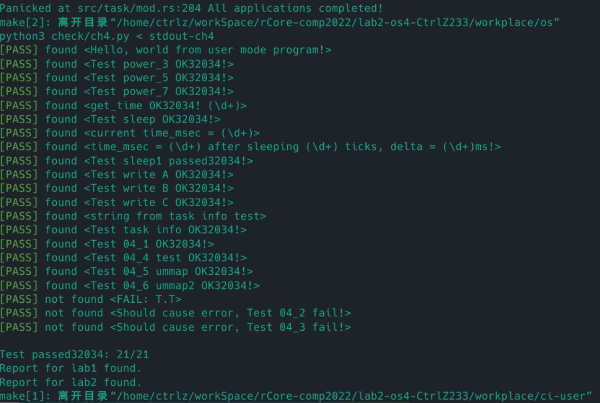

# Lab2实验报告
### 重写 sys_get_time 和 sys_task_info
开启虚拟地址后，系统调用从用户态传入的地址参数要经过用户地址空间的页表进行转化，得到物理地址，由于在内核态虚拟地址和物理地址是对等映射，因此刚刚转化得到的物理地址可以在内核态当作虚拟地址直接访问。

因此只需要将 `TimeVal` 和 `TaskInfo` 的地址进行转化，然后重新赋值即可。

### mmap 和 munmap 匿名映射
#### mmap
先检查 `_start` 的对齐情况和 `_port` 的合法情况，然后获取当前任务的地址空间，检查当前可用的物理页的数量是否足够（`end` -`current` + `recycled.len()` ），然后遍历需要映射的所有虚拟页，检查存在页已经存在于 `area` 的 `data_frames` 中。如果不存在，在根据 `port` 获取对应页的访问权限，调用 `push` 方法插入页映射。
#### munmap
先检查 `_start` 的对齐情况， 然后获取当前任务的地址空间，检查当前要去映射的虚拟页是否都在 `area` 的 `data_frames` 中，如果都在，就遍历地址空间中的 `areas` ，找到 `VPNRange` 和传入的参数相同的 `area` ，调用对应 `area` 的 `unmap` 方法，并把其从 `areas` 中删掉以出发 `Drop` 来回收物理页。

### 实验截图

# 问答题
1. 共64位，高10位保留，而中间的三个PPN（共44位）作为MMU地址转换时的页表索引，而RSW两位留给S Mode的应用程序用于扩展。低8位则是标准位，用于描述页表项所描述的页表的状态，从高到低分别是：
    - D(Dirty)：处理器记录自从页表项上的这一位被清零之后，页表项的对应虚拟页面是否被修改过；会被处理器动态设置。
    - A(Accessed)：处理器记录自从页表项上的这一位被清零之后，页表项的对应虚拟页面是否被访问过，会被处理器动态设置。
    - G：全局地址代换（？）。
    - U(User)：控制索引到这个页表项的对应虚拟页面是否在 CPU 处于 U 特权级的情况下是否被允许访问。
    - R(Read)/W(Write)/X(Execute)：分别控制索引到这个页表项的对应虚拟页面是否允许读/写/执行。
    - V(Valid)：仅当位 V 为 1 时，页表项才是合法的。
2.
    1. InstructionPageFault、LoadPageFault、StorePageFault、InstructionGuestPageFault、LoadGuestPageFault、StoreGuestPageFault。
    2. 发生缺页时：
        - scause：存储异常的具体类型。
        - sstatus：记录处理器当前状态，最重要的是SSP为当前的特权级。
        - stvec：存储Trap的处理入口地址。
        - sepc：存储异常发生的下一条指令地址。
        - stval：存储缺页异常的虚拟地址。
    3. 在开始加载程序时会更快；内存利用效率会更高
    4. 需要的物理页框数量大约为：$1+10\times(1 + 512) = 5131$
       需要的物理内存大小为：$4KB \times 5131 =20524KB\approx20MB$
    5. 实现Lazy策略的大概思路：在加载用户程序分配内存时不真正分配内存，而是将地址于磁盘中的elf数据的位置对应起来存到内存，然后在运行时发生缺页异常后根据elf位置对应关系为程序分配内存并把数据加载到内存中。
    6. 页面失效会将标志位`V`置为`0`
3.
    1. 只有在用户进程切换的时候才需要切换页表。
    2. 将内核页的`U` 标志位置为`0`。
    3. 用户和内核切换的时候不需要切换页表，这对需要从用户态将虚拟地址当作参数传入内核态的系统调用，更加方便。
    4. 双页表实现下，只要内核态和用户态发生切换，就需要同时切换页表，而单页操作系统，只需要在内核态同时切换另一个进程时才需要切换页表。