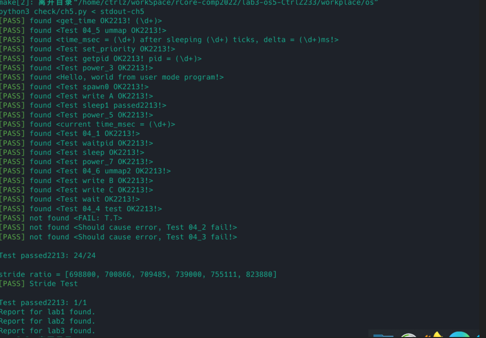

# Lab3实验报告
## 进程创建
新增 `sys_spawn` 系统调用，先根据当前进程中的页表得到从用户态传入的文件名，检查用户程序是否存在，然后根据文件名获取程序的 `elf` 数据。在 `TaskControlBlock` 中新增 `spawn` 方法，在方法中，需要根据传入的 `elf` 数据生成 `memset_set` 、`pid` 、内核栈。然后根据新申请的资源和从 `elf` 中得到的数据新建 `TaskControlBlock` 并返回，把生成的 `TCB` 加入调度队列中即可。


## stride调度算法
在 `TCB` 中新增 `priority` 和 `pass` 字段，`priority` 默认为 1，`pass` 默认为 0。

为 `Pass` 结构体实现 `PartialOrd Trait` ，为了避免溢出，先判断两个 `pass` ，由于已知$|pass_a-pass_{b|}<= BigPass/2$ 。不妨假设$pass_{b}> pass_a$且$pass_{b}> BigPass$ ，则在计算机中的表示：$pass_{b}^{'} = pass_{b}- BigPass$。则
$$|pass_{b}^{'}-pass_{a|}>=BigPass/2$$
因此有如下对 `Pass` 的判断比较：
$|pass_a-pass_{b|}<= BigPass/2$ ，则无溢出，正常比较。

$|pass_a-pass_{b|}>= BigPass/2$，则较大值产生溢出，大小比较结果翻转。

而在 `TaskManager` 中改用优先队列存储 `TCB`，在 `run_tasks` 中取出 `Pass` 最小的 `TCB` 进行调度，每次得到调度的 `TCB` 会将 `pass` 增加 $BigStride/priortiy$ ，超过 `BigStride` 则做取模的溢出处理。
## 实验截图


# 问答题
1. 暂时不会轮到p1执行，此时p2溢出后翻转为5，比p1更小，会被调度很长一段时间。
2. 假设当前存在序列，
3. 设计的比较大小算法如下：
```rust
impl PartialOrd for Pass {
    fn partial_cmp(&self, other: &Self) -> Option<Ordering> {
        if self.0.abs_diff(other.0) <= (BIG_STRIDE / 2) {
            Some(self.0.partial_cmp(&other.0).unwrap())
        } else {
            Some(self.0.partial_cmp(&other.0).unwrap().reverse())
        }
    }
}
```
为了避免溢出后的值正好等于较小值的情况， `BigStide` 设置为奇数。