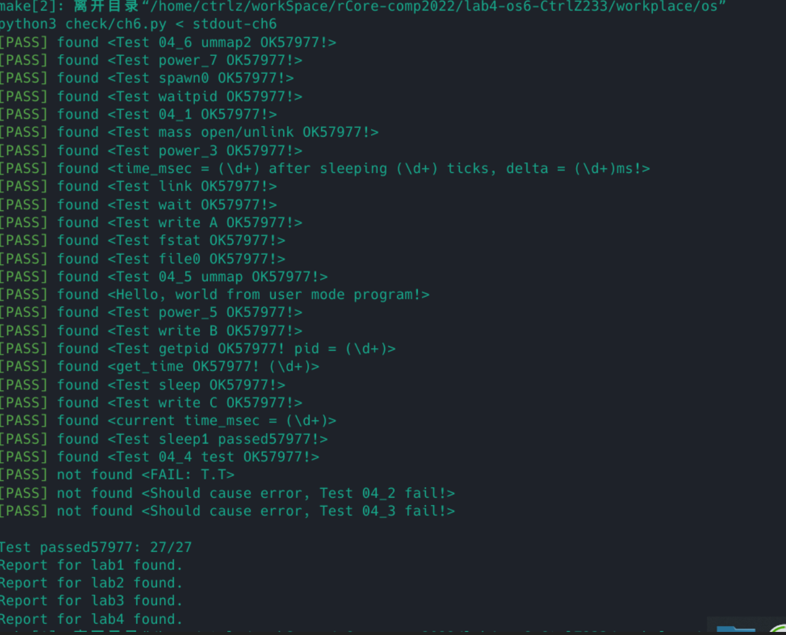

# Lab4实验报告
在 `DiskInode` 中添加对硬链接的计数 `nlink` 。

## linkat
对于 `linkat` 系统调用，先找到 `old_path`  文件所在的 `inode_id` ，然后在相应目录下创建一个 `DirEntry` ，名字为 `new_path` 所在名字， `inode_number` 为之前获取的 `inode_id` ，同时对 `inode id` 对应的 `DiskInode` 的 `nlink` 计数加一。

## unlinkat
对于 `unlinkat` 系统调用，先根据文件路径找到对应的 `inode` 和 `DiskInode` ，将 `nlink` 减一，如果此时的 `nlink` 为 0，则需要清空 `inode` 索引的磁盘块资源。然后删除对应的目录项，并把同级目录下的目录项前移。

## fstat
对于 `fstat` 系统调用，通过 `fd` 获取对应的 `dyn File` ，这里对每个 `dyn File` 实现一个 `Object Trait`， 该 trait 下实现方法 `as_any` 获取当前 `File` 的具体类型，在 `fstat` 中可以得到具体类型为 `OSInode` ，然后通过 `OSInode` 获取 `Inode`和 `DiskInode` 的相关信息填充到 `Stat` 中去。

## 实验截图

# 问答题
`root inode` 是文件系统中所有文件的总入口，挂载了整个文件系统，其中包括了我们编写的用户程序，如果root inode中的内容损坏，将导致整个文件系统的所有文件都无法访问。